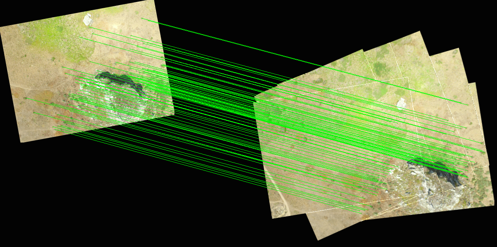
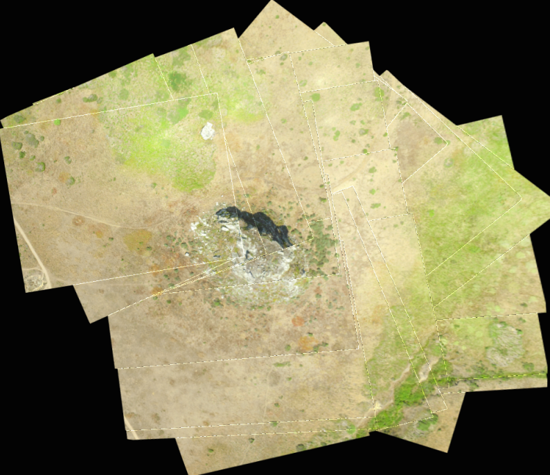

# Planar Mosaic Reconstruction

## Requirements:
* Tested on OSX 10.10.5, Using Python 2.7.10
* OpenCV 3.0.0 (https://github.com/Itseez/opencv/ -- git checkout 3.0.0)
* OpenCV_contrib 3.0.0 (https://github.com/Itseez/opencv_contrib -- git checkout 3.0.0)
* Use CMAKE arguments: cmake -D CMAKE_BUILD_TYPE=RELEASE -D CMAKE_INSTALL_PREFIX=/usr/local -D WITH_TBB=ON -D BUILD_NEW_PYTHON_SUPPORT=ON -D WITH_V4L=ON -D INSTALL_C_EXAMPLES=ON -D INSTALL_PYTHON_EXAMPLES=ON -D BUILD_EXAMPLES=ON -D WITH_QT=OFF -D WITH_OPENGL=OFF -D OPENCV_EXTRA_MODULES_PATH=../opencv_contrib/modules/ ..
* numpy (pip)
* imutils (pip)

## Usage

Make sure pose.csv is located within the same directory as the images. The pose.csv file should have the following format:

```
filename,latitude,longitude,altitude,yaw,pitch,roll
dji_0644.jpg,­123.114661,38.426805,90.689292,9.367337,1.260910,0.385252
...
```

On a 13" macbook pro, the following command provides a nice balance between screen real estate and processing time.

```
./mosaic.py -d datasets/example1 -is 0.1 -os 0.9
```

``-is`` is the scaling on the input images (smaller value = smaller images, faster processing)
``-os`` is the scaling on the output container (smaller value = smaller output mosaic)
``-m`` is for intermediate matching visualizations.

## Examples

The following shows the intermediate feature matching



The following shows the result after stitching 24 images


